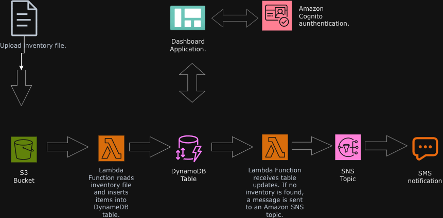

# ☁️ Serverless Inventory Tracking System (S3 → Lambda → DynamoDB → SNS)

**Portfolio Project – CloudWithAlex**

## 📌 The Problem
A global retail company needs a simple way to track inventory levels from stores around the world.

Each store uploads an inventory CSV file (store, item, count). The business wants:

- Inventory data automatically stored in a database
- A web dashboard to view inventory levels
- Automatic notification when any item is out of stock (count = 0)
- A solution that scales automatically without managing servers

Traditional server-based designs would require running and maintaining EC2 instances, handling scaling, patching, and paying even when idle.

---

## ✅ The Solution (Serverless Architecture)
I implemented an **event-driven serverless architecture** using AWS managed services.

### Architecture Flow (High Level)
1. A store uploads an inventory CSV file into an **Amazon S3 bucket**
2. The upload triggers **Lambda Function #1 (Load-Inventory)**
3. Lambda reads the CSV and inserts items into a **DynamoDB Inventory table**
4. A **web dashboard** (static site) displays inventory by reading from DynamoDB
5. DynamoDB updates trigger **Lambda Function #2 (Check-Stock)** using **DynamoDB Streams**
6. If `Count = 0`, Lambda publishes an alert to an **SNS topic**
7. **Amazon SNS** sends an Email/SMS notification to the inventory team

---

## 🧱 Architecture Diagram


---

## 🧰 AWS Services Used
- **Amazon S3** – Stores uploaded inventory files + hosts static dashboard
- **AWS Lambda** – Runs code automatically on file upload & database updates
- **Amazon DynamoDB** – NoSQL database to store inventory records
- **Amazon DynamoDB Streams** – Sends table change events to Lambda
- **Amazon SNS** – Sends low-stock alerts via email/SMS
- **Amazon Cognito** – Authentication for dashboard access (anonymous/controlled access)
- **Amazon CloudWatch Logs** – Debugging and monitoring Lambda execution

---

## 🧪 Step-by-Step Implementation (What I Built)

### 1) Create DynamoDB Table
- Table name: `Inventory`
- Stores inventory items by:
  - `Store` (string)
  - `Item` (string)
  - `Count` (number)

### 2) Create Lambda Function #1: `Load-Inventory`
- Runtime: Python 3.9
- Trigger: **S3 Object Created**
- What it does:
  - Downloads CSV file from S3 to `/tmp/`
  - Reads each row
  - Inserts items into DynamoDB using `put_item`

### 3) Create S3 Bucket and Configure Event Trigger
- Create a bucket: `inventory-<random-number>`
- Add event notification:
  - Event type: **All object create events**
  - Destination: Lambda function (`Load-Inventory`)

### 4) Upload Inventory CSV Files
- Upload sample files (e.g. Berlin, Karachi, Shanghai)
- Confirm:
  - Lambda runs automatically
  - DynamoDB table receives new items

### 5) Create SNS Topic + Subscription
- SNS Topic name: `NoStock`
- Subscription:
  - Protocol: Email (or SMS)
  - Confirm subscription via email link

### 6) Create Lambda Function #2: `Check-Stock`
- Runtime: Python 3.9
- Trigger: **DynamoDB (Streams)**
- What it does:
  - Checks new inserted items
  - If `Count == 0`, sends alert to SNS topic

### 7) Test End-to-End
- Upload another inventory CSV
- Confirm:
  - Dashboard shows both stores inventory
  - Email/SMS alert is received when out-of-stock item exists

---

## ✅ Result (What Worked)
- Successfully processed inventory CSV uploads using S3 triggers
- Inventory data automatically loaded into DynamoDB
- Dashboard displayed inventory data from DynamoDB
- Out-of-stock items triggered SNS notifications (Email/SMS)
- Fully serverless design: **no EC2**, auto-scaling, and low cost when idle

---

## 📂 Repository Structure
```bash
aws-serverless-inventory-tracking/
├── README.md
└── assets/
    └── architecture.png
